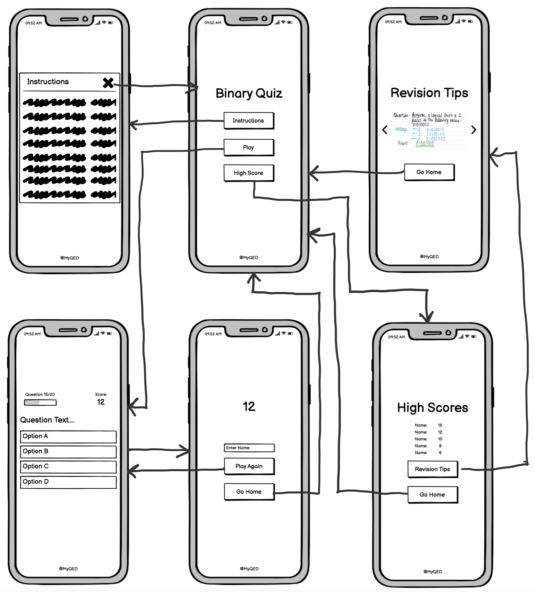
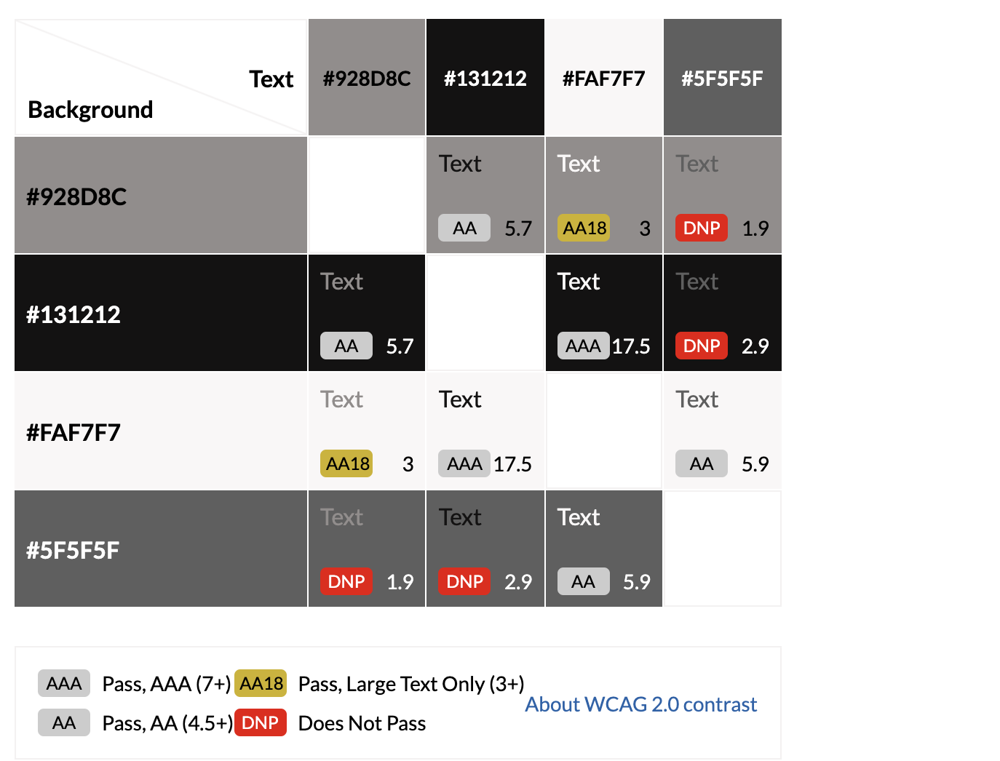
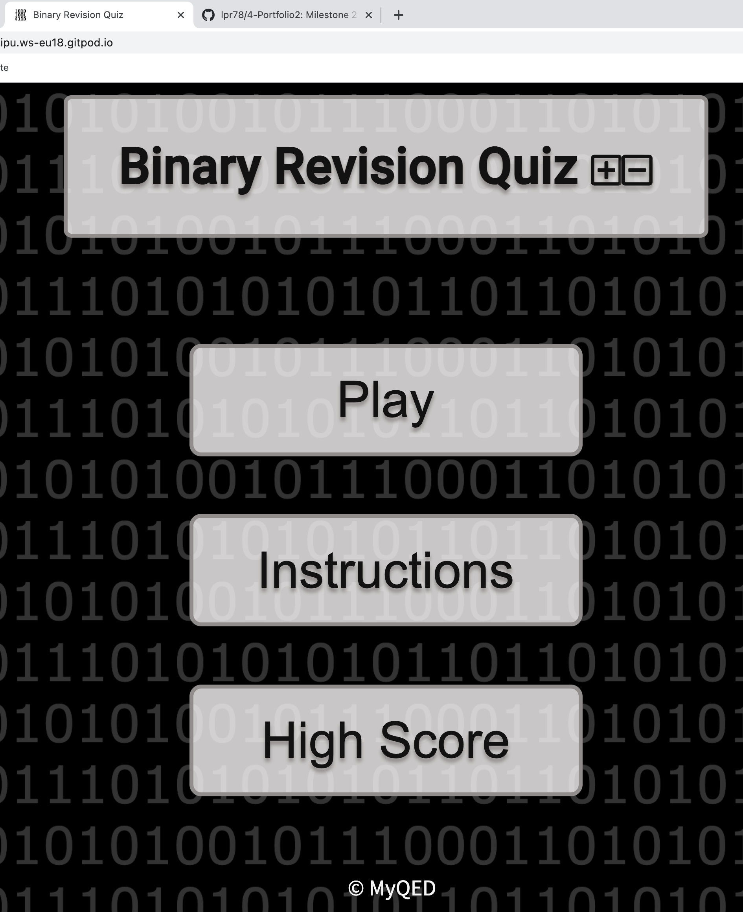
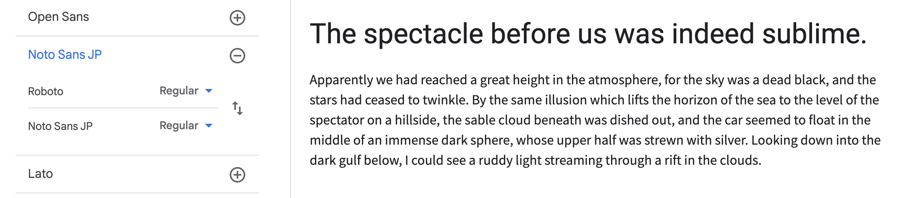
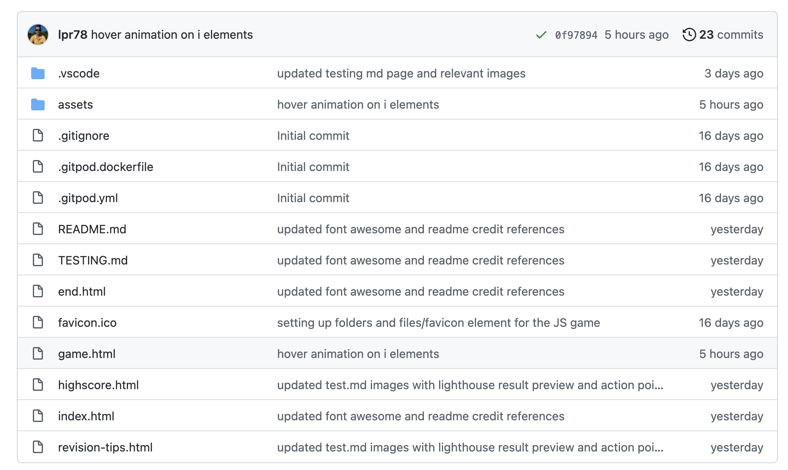

# Binary Manipulation and Simplication Game

## Introduction
* Computer Science teaching is gradually moving towards non-computer based classroom learning, with limited school based equipment availability.
* Resulting in the lack of interactivity in the lesson, utilising technology.
* The intention is to supply a mobile quiz solution for learners on an A-Level/GCSE Computer Science course, focusing on the topic: Binary Manipulation and Simplication.
* The web based application can be accessible via mobile devices or limited mobile device technology accessible to the teacher
* The game element can be utilised as a starter or plenary activity, testing knowledge at the end of the topic delivery
* The game itself will be a full graphical user interface which would benefit with a time-based element to mimic the examination time
* The game would complement working time for the learner to plan their answers, which can also be handed into the teacher, to show workings towards a set of questions
* A multiple choice element in the game can at least direct the learner to rework their answers, if none of the choices were available. 

* Link to view final game via [GitHub repository](https://github.com/lpr78/4-Portfolio2) and [live site](https://lpr78.github.io/4-Portfolio2/). 

## Table of Content

- [Binary Manipulation and Simplication Game](#binary-manipulation-and-simplication-game)
  - [Introduction](#introduction)
  - [Table of Content](#table-of-content)
  - [Strategic Plane](#strategic-plane)
    - [Purpose](#purpose)
    - [User Stories](#user-stories)
  - [Scope Plane](#scope-plane)
    - [Planned Features](#planned-features)
  - [Structure Plane](#structure-plane)
    - [Opportunities](#opportunities)
  - [Skeleton Plane](#skeleton-plane)
    - [Wireframe](#wireframe)
  - [Surface Plane](#surface-plane)
    - [Designs](#designs)
      - [Background Content](#background-content)
      - [Colour Strategy](#colour-strategy)
      - [Typography](#typography)
      - [Icons and Characters](#icons-and-characters)
  - [Features](#features)
  - [Future Enhancements](#future-enhancements)
  - [Testing Strategy](#testing-strategy)
  - [Further considerations](#further-considerations)
  - [Deployment Strategy](#deployment-strategy)
  - [Credit and References](#credit-and-references)
    - [References](#references)
    - [Credit](#credit)

## Strategic Plane
### Purpose
* To provide students with a fun way of learning content at the end of the topic delivery
* To create a graphical user interface to support their learning with is fully accessible via a mobile device
* Media access controls support ipad and iphone size screens with limited left/right scrolling
* Screen reader technology assistance should be compatiable with the game play
* Up to 20 exam style questions that complement the following topics: 
    + Binary Addition
    + Binary Subtraction
    + Ones Complement
    + Twos Complement
    + Bitwise Manipulation
    + Boolean Simplication
    + Karnaugh Map
 
* A time based element to respond to the exam style question
* An appropriate output that supports the learner in being able to navigate solutions to the question and further revision links to support their learning

### User Stories
* As a user i want an easily accessible game that supports my learning of binary manipulation and simplication
* As a user i want to be able to answer a series of questions and know how successful during my learning journey
* As a user i want to see exam style questions that compliment actual exam style questions
* As a user i want to be able to be able to play the game inside and outside a classroom environment via a mobile device
* As a user i would like the game to accessible via a touchscreen, to reduce keyboard functionality
* As a user i would like to be able to have support with assistive technology to read questions and potential answers
* As a user i would like to minimise the amount of navigation to limited buttons

## Scope Plane

### Planned Features
* Although the target device is predominantly for mobile devices, it should also be accessible on a computer screen (max-width: 2000px)
* All navigational elements within the game should be clear for users to click and access features within the game
* The user interface should be clear with high contrast between the background and foreground elements
* The interface should compliment touchscreen technology (core audience) as well as keyboard functionality (peripheral audience)
* An appropriate time frame for each question (considering 2 minutes per question, forwarding to next question with no interaction)
* Utilise DOM elements to personalise the game to the user, considering naming element and score feature with encouraging messages
* To provide working solutions for the user to see exemplar answers to each question, accessible at the end of the quiz
* A top score feature that motivates the learner to engage a repeat of the revision questions to improve their score
* Simple html elements that limits the number of html pages within the design
* Storing questions and high scores within an external file (for easy recall each time the game is played and recall previous scores)
* Using multiple choice questions, 4 options per question (as per research 4 options seems a popular choice)
## Structure Plane
<table>
<tr><th>User story</th><th>Success Criteria</th><th>Implementation plan</th></tr>
<tr><td>As a user i want an easily accessible game that supports my learning of binary manipulation and simplication</td><td>The user should be able to access a game through with clear labelled navigation and instruction support for advice and guidance on starting the game</td><td>Simple navigational buttons, with limited screen text.  Modals can also assist with message instructions without navigating away from the game itself.</td></tr>
<tr><td>As a user i want to be able to answer a series of questions and know how successful during my learning journey</td><td>User should be able to see attainment as they go through a series of questions to support their learning</td><td>Relevant score increments re-calculated at the end of each question that update according to the question that they are doing. </td></tr>
<tr><td>As a user i want to see exam style questions that compliment actual exam style questions</td><td>Identify suitable exam questions and use 'similar but different' approach to be able to show misconceptions in workings that are common within the actual exam</td><td>Use multiple choice options that are plausible misconceptions with a correct answer expected to increment the total score.</td></tr>
<tr><td>As a user i want to be able to be able to play the game inside and outside a classroom environment via a mobile device</td><td>A simple GUI that allows the user to navigate the main elements of the game</td><td>limit the number of html pages and consider the use of modals and CSS display options to limit the navigation away from the game itself.</td></tr>
<tr><td>As a user i would like the game to accessible via a touchscreen, to reduce keyboard functionality</td><td>Simple clear navigational elements that allow the user to progress through the game and see their result at the end of the game with relevant tools to support how the answers could be achieved.  As the game has a timer the user would be expected to workout their answers which can then be cross referenced with the actual working solution</td><td>The game should be accessible on both computer screens, utilising a key board event listerner as well as relevant touch elements with clear box elements</td></tr>
<tr><td>As a user i would like to be able to have support with assistive technology to read questions and potential answers</td><td>Allow screen reading technology on elements associated with the game and relevant accessibility feature to ensure high contrast functionality</td><td>Apply a setting feature that triggers accessibility features, such as high contrast and utilise relevant aria HTML elements within the actual game itself to allow greater functionality for those users that require assistive technology.</td></tr>
<tr><td>As a user i would like to minimise the amount of navigation to limited buttons</td><td>Reduce the number of user touches/clicks to navigate throughout the game</td><td>Ensure automated features navigate to relevant questions within the user having to click (NEXT) to the appropriate question. </td></tr>
</table>

### Opportunities
* Provide a gaming environment that utilises colour schemes and contrast that are appropriate to the core audience (14 to 18 year olds)
* Elements within the game should be a size that compliment both mobile and computer displays
* Consider animated elements on buttons (mostly mouseover events) that help the user locate their intended options within the multiple choice game
* Use a timer to reduce the amount of time for each question to allow a timely completion of the game itself, to support the teacher to use as a 10 minute starter or plenary activity
* Consider external storage of game questions that are random (to reduce copying their peers) and stores game scores that can easily be retrieved when re-calling the content of the game.
* Supportive material utilising innerHTML elements that allow the learners to see model answers relating to the questions, which they have control to see and utilise.  


## Skeleton Plane

### Wireframe

Initial idea before wireframe intention:


Mobile application wireframe design using [Balsamiq](https://balsamiq.com/) that simplifies the construction and intended route element between each of the quiz elements: 



## Surface Plane

### Designs
From a design perspective, the main focus is the game interactivity and the ability for the user to complete the theory questions promptly.  I completed a mock-up page using GitPod using essential button elements and playing around with the CSS elements to ensure a high contrast demonstrated within the colour strategy section.  

I have chosen high contrast with a dark background and light foreground to ensure that the readability is accessible on mobile devices.  [Material.io](https://material.io/design/color/dark-theme.html) suggests that the different shades of black and light writing contribute to a 'dark theme'.  However, the solid black and soft tonal text colours would be appropriate for the prototype because the intended background has dark grey text for the random binary values.      

#### Background Content

The following images have been sourced as the html background, one requiring attribute permission and the other one created by myself, using pixlr:

<table>
<tr><th>Image requiring attributes</th><th>Own Image idea</th></tr>
<tr><td><br><a href="https://www.vecteezy.com/free-vector/binary-code-background">Binary Code Background Vectors by Vecteezy</a></td><td><br>Created by myself using <a href = "https://pixlr.com/">Pixlr</a></td></tr>
</table>

I decided to go with the image that i created for the html pages, as this had a higher contrast between both the foreground and background elements, to support accessibiity requirements.  

#### Colour Strategy
* With binary having limited values of 1 or 0, i decided to utilise this within the colour them, focusing on the grayscale approach.  
* To ensure a high contrast and visibility, i will utilise the light on dark approach, to ensure that the user can see the content. 



* I have showcased below what the end result of the colour theory exercise could be visualised as on the landing page test:



The benefit of this approach is to ascertain how the colour theory can be utilised and i am happy with the contrast element.  Further enhancements will be made to Version 1 designs to ensure that the contrast scores from the previous project exceeded.

#### Typography

For the heading i will use Roboto:

``` font-family: 'Roboto', sans-serif;```

For the body text i will use Noto Sans JP:

``` font-family: 'Noto Sans JP', sans-serif;```

Example text to showcase the heading and body text:



#### Icons and Characters
Icons for the game will be retrieved from [Font Awesome](https://fontawesome.com/) and embedded into the relevant DIV element.  In the first instance, i would need to add the following link into the relevant html page (in the header) to ensure the visibility of the icons on display. 

```<link rel="stylesheet" href="https://use.fontawesome.com/releases/v5.8.1/css/all.css"> ```  

## Features
* Buttons to navigate through the game from the landing page (index.html) and throughout
* Modal instructions that support the user in how to play the game
* Icons to further enhance instructions on game play and exiting the game
* Count down to allow a timed element to play the game
* Box selections for the multiple choice quiz
* Relevant images to show how the answers could be achieved from the question
* High score board to showcase the top 5 best attempts within the time frame
* Relevant external links to further resources to support knowledge recall for future game plays
* High contrast between background and foreground elements

## Future Enhancements
The following enhancements would require action, if the JS game were to meet above the PASS criteria or working towards a final release deployment. 
* The actual timer was not added to the game and this was a success criteria point that was supposed to be added to the game itself. Further learning required to complete this task in as a learning development point.
* The #progressbarfull does not sit properly in the #progressbar and would need adapting into the final deployment.  More time required to identify how this element can be improved. 
* Review game play with further interaction, such as a modal appearing with the solution if the question response is incorrect, to reduce the number of clicks.
* The above suggestion for the modal could also include the relevant external link to the relevant website resource.
* A graded outcome to inform the user what the equivalent grade would be, based on their attempt.
* Individualised messages from a JSON file that can support the previous bullet point.
## Testing Strategy
* Refer to the following link to see a diarised approach to testing and noterised feedback
  * [Testing Link](TESTING.md)

## Further considerations
* I would like to address the timing criteria on the game.  At present (with current time constraints) this has not been achieved resetting on each question, it merely resets the time.
* Further time i feel that the timer element controls and alerts would be better as a modal with advice video links and then a buttons to progress to the next question would be a good addition to the quiz game to ensure that when the modal button is clicked => it progresses to the next question automatically after 2 minutes if not answered.
* The width of the #ProgressBarFull does not perfectly inside of the #ProgressBar and further consideration of this is preferred, if more time permitted.
* The size of the help modal image is too small on mobile view and therefore needs consideration, in terms of increasing the size in order to fulfill the success criteria. 
* I feel that the modal solutions would be better placed as a flex-box div display that is shown when on an iphone width
* The game itself is by no means perfect and further consideration to the test user and grammatical checking would help identify further updates, such as increasing the size of the timer element on the game page itself.   


## Deployment Strategy
The initial web template was cloned from into my GitHub repository: 

```https://github.com/Code-Institute-Org/gitpod-full-template``` 

* An alternative approach to use this template in GitPod is by using the following in the Gitpod terminal: ```git clone https://github.com/Code-Institute-Org/gitpod-full-template.git```
* You can cut ties by typing ```git remote rm origin``` into the terminal either globally or locally.
* However, i chose to clone the template into my GitHub repository and then ported across to GitPod to further develop the code required for the Binary Quiz Game.
* Regular commits from GitPod to GitHub were made in order to access the repository outside of the GitPod Online Application, using the following terminal commands:
  * ```git add .```
  * ```git commit -m "relevant comment to changes to the directories and updates"```
  * ```git push``` which updates the relevant GitHub repository based on the GitPod changes.  
  
* As of 17/10/21 - 23 commits have been made to GitHub from GitPod using the above commands in terminal:


* The landing page to the game was named ```index.html``` for deployment and routing purposes.
* Alot of the testing of code elements were completed locally, using Visual Studio Code and there is an alternative approach to work locally and still update to Github.
  * The following link explains how to clone and work between GitHub and Visual Studio Code on the followings: 
    * [Link1](https://docs.microsoft.com/en-us/azure/developer/javascript/how-to/with-visual-studio-code/clone-github-repository)
    * [Link2](https://code.visualstudio.com/docs/editor/github)
* As my role involves working away with sometimes unpredictable wifi and data roaming, it is viable to utilise local storage for testing purposes and commit to GitHub reguarly.
    

## Credit and References

### References
* Understanding [Flexbox controls](https://css-tricks.com/snippets/css/a-guide-to-flexbox/)
* Tutoring support and following walkthrough examples for [quiz game](https://www.youtube.com/playlist?list=PLDlWc9AfQBfZIkdVaOQXi1tizJeNJipEx)
* [Setting up contents page on README file](https://ecotrust-canada.github.io/markdown-toc/)
* [background image](https://www.vecteezy.com/vector-art/174467-matrix-style-binary-background)
* [bootstrap modal](https://getbootstrap.com/docs/4.0/components/modal/)
* [alternative modal considerations](https://sabe.io/tutorials/how-to-create-modal-popup-box)
* [consideration towards a game timer](https://stackoverflow.com/questions/44314897/javascript-timer-for-a-quiz)
* [carousel idea](https://medium.com/@marcusmichaels/how-to-build-a-carousel-from-scratch-in-vanilla-js-9a096d3b98c9)
* [Further carousel ideas](https://medium.com/@marcusmichaels/how-to-build-a-carousel-from-scratch-in-vanilla-js-9a096d3b98c9)
* [computer science questions inspired by this textbook](https://www.pgonline.co.uk/resources/computer-science/a-level-ocr/ocr-a-level-textbook/)
* [offline editor Visual Studio Code used while working away](https://code.visualstudio.com/)
* Photoshop used to create background image for the quiz game
* Code Institute [GitPod Full Template](https://github.com/Code-Institute-Org/gitpod-full-template)
* Code Institute [ReadMe Guidance](https://github.com/Code-Institute-Solutions/readme-template)
* [GitPod README Assist](https://docs.github.com/en/github/writing-on-github/getting-started-with-writing-and-formatting-on-github/basic-writing-and-formatting-syntax)
* Optimisation of PNG images from [TinyPNG](https://tinypng.com/)
* Binary [Favicon](https://www.favicon.cc/?action=icon&file_id=258253)
* [Timer Element for Quiz](https://stackoverflow.com/questions/44314897/javascript-timer-for-a-quiz)
* [Further timer element inspiration used within the game element](https://jsfiddle.net/wr1ua0db/17/)
* Checks of validity and accessibility of coding elements: [W3C HTML Validator](https://validator.w3.org/), [W3c CSS Validator](https://validator.w3.org/) and [JSHint](https://jshint.com/)

### Credit
* Code Institute - Support on links between GitPod and Git Hub and usability requirements
* Code Institute - Relevant Slack Channel advice and guidance from previous students
* Prototype 1 Reviewers: Katie Tuck and Dave Blyth on usability testing (held virtually via Zoom)
* Prototype 2 Reviewer: Paul Kemp for final usability testing (held face to face on 28/10/21 in Bristol)
* Relevant feedback from Brian Macharia - Mentor support in the 1 meting identifying final iterative testing requirements


