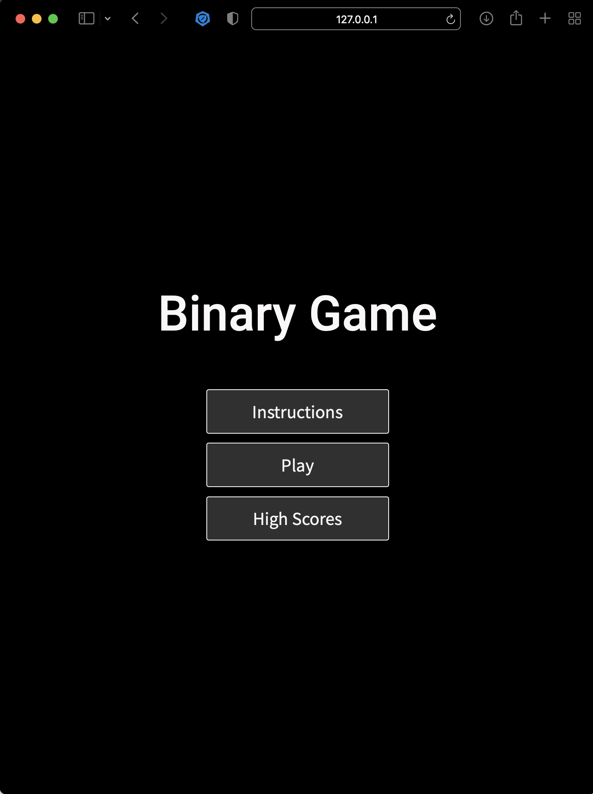
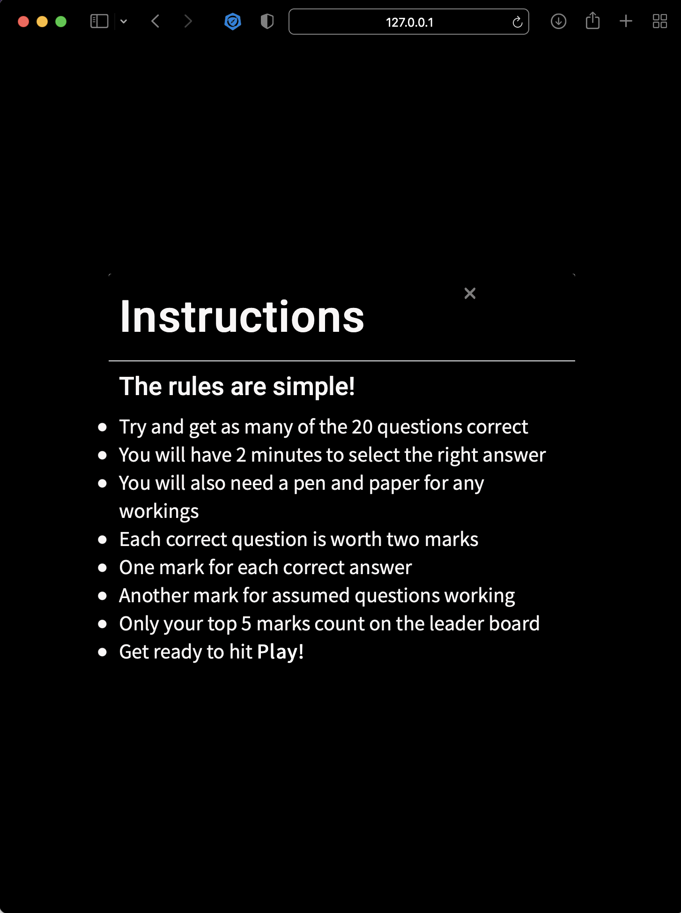
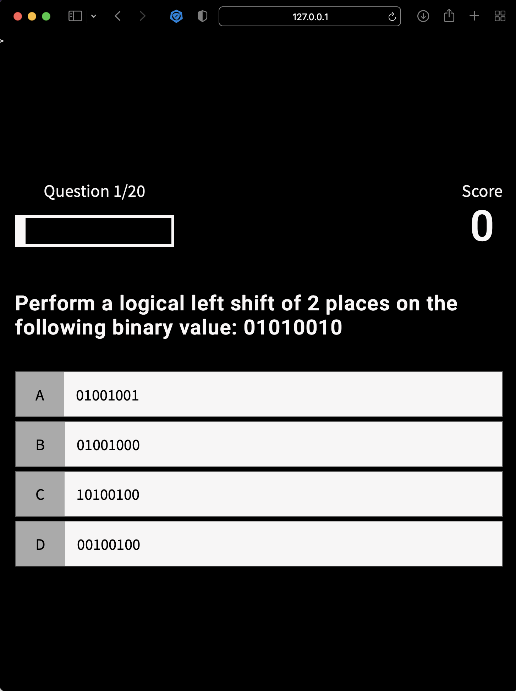
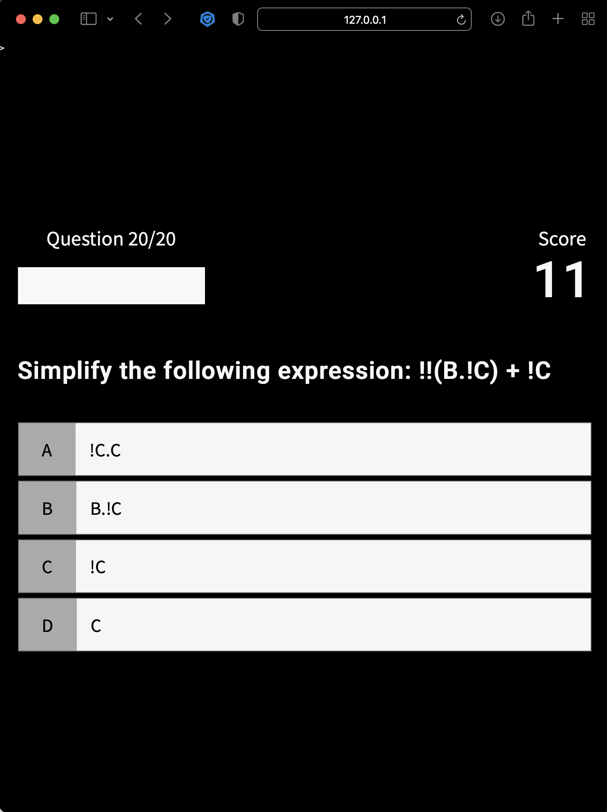
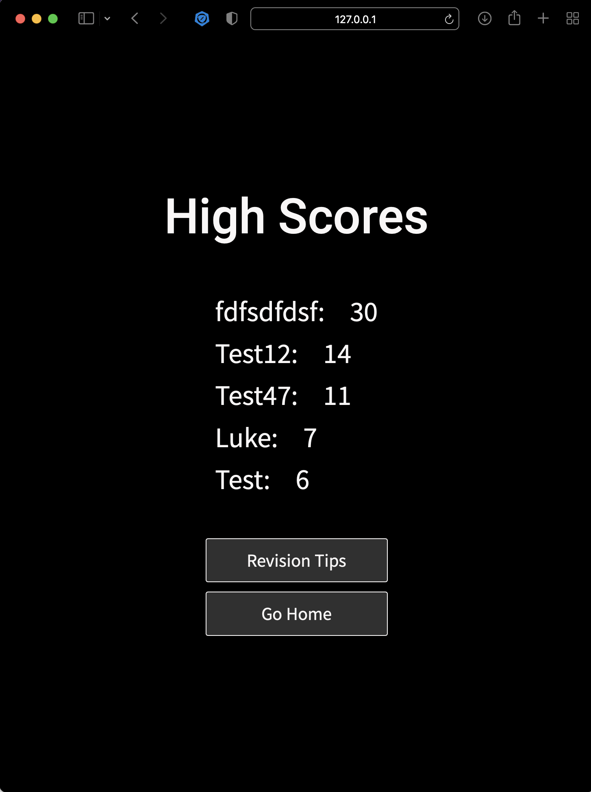
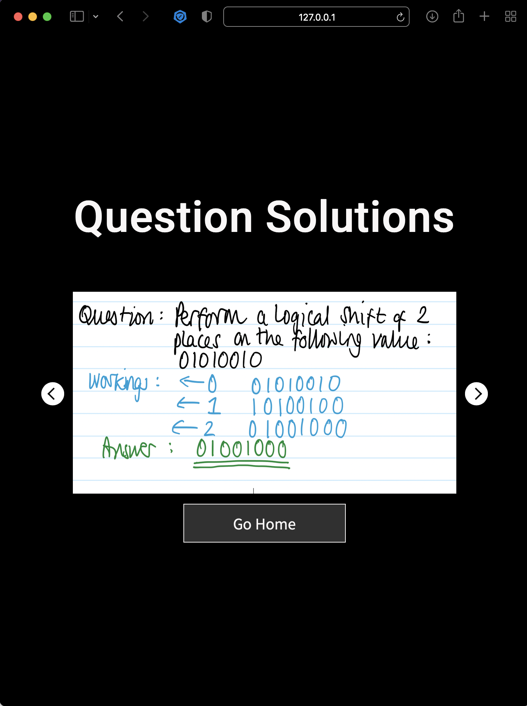

[Back to README](README.md)

## Version 1: Binary Game
### Date: 14/10/21
* The following application of knowledge has been demonstrated based on the resources and inspiriation (as shown in the credit section).
* Version 1 was built using [Visual Studio Code](https://code.visualstudio.com/) - utilised while working away for a couple of weeks and being away from main computer.  
* Initial testing on varying responses conclude the base files are supporting of most success criteria.

### Images of Version 1

<table>
<tr><td>Initial landing page element:</td><td>Modal instructions when Instruction button pressed: </td></tr>
<tr><td></td><td></td></tr>
<tr><td>Game opens when the Play button pressed on Landing page:</td><td>Showing progress bar complete with a score of 11/20: </td></tr>
<tr><td></td><td></td></tr>
<tr><td>Once game completes it moves to a screen that allows the user  to enter their name and brings their score across from the game:</td><td>Showing the game result of Test47 in the top 5 scores:</td></tr>
<tr><td></td><td></td></tr>
</table>

Carousel showing exemplar responses that the leaner could use for each question that they have answered:

### Further Considerations for Version 2:
* Background image no longer on display when utilising Bootstrap Modal.  Need to remove Boostrap to see background image.  Consideration to using JS as part of the modal for Instruction button may be a viable option.
* Add modal on revision page to relevant revision videos to further support learning of the topics past the exemplar answers and processes (especially where the boolean algebra rules are considered)
* Clear Stored array element on top 5 when transferring across to GitPod from Visual Code
* Transfer content to GitPod to ensure updated to GitHub linked (need to retrieve log in information once back home on the 21/10/2021)
* Time element to be between progress bar and score that automatically changes question after 2 minutes
* change correct score constant to 2 marks, not 1
* Review visualisation diagrams when back home

[Back to README](README.md)
