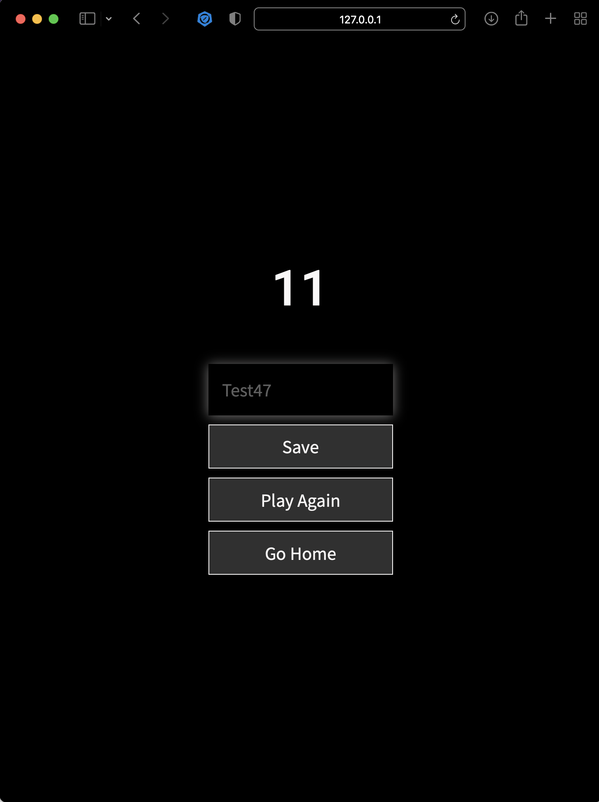
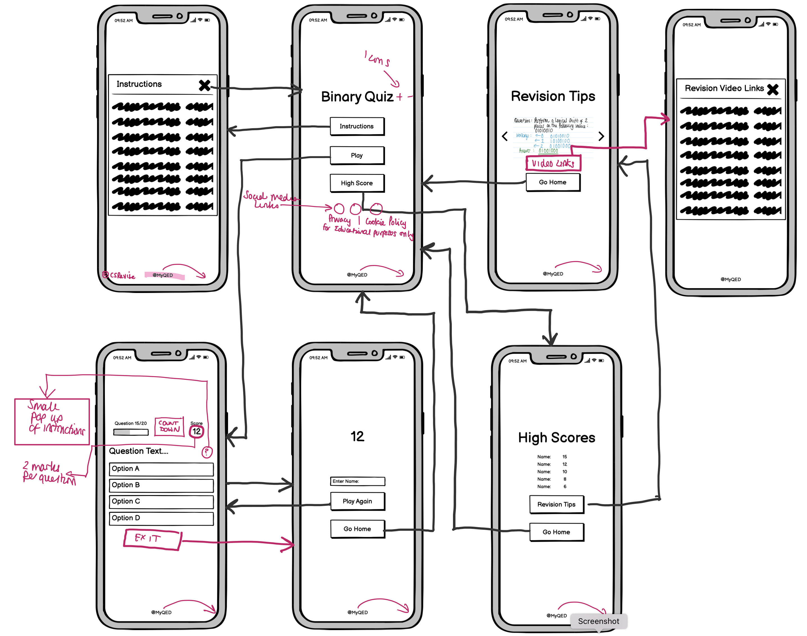

[Back to README](README.md)

## Version 1: Binary Game
### Date: 14/10/21
* The following application of knowledge has been demonstrated based on the resources and inspiriation (as shown in the credit section).
* Version 1 was built using [Visual Studio Code](https://code.visualstudio.com/) - utilised while working away for a couple of weeks and being away from main computer.  
* Initial testing on varying responses conclude the base files are supporting of most success criteria.

### Images of Version 1

<table>
<tr><td>Initial landing page element:</td><td>Modal instructions when Instruction button pressed: </td></tr>
<tr><td></td><td></td></tr>
<tr><td>Game opens when the Play button pressed on Landing page:</td><td>Showing progress bar complete with a score of 11/20: </td></tr>
<tr><td></td><td></td></tr>
<tr><td>Once game completes it moves to a screen that allows the user  to enter their name and brings their score across from the game:</td><td>Showing the game result of Test47 in the top 5 scores:</td></tr>
<tr><td></td><td></td></tr>
</table>

Carousel showing exemplar responses that the leaner could use for each question that they have answered:

### Lighthouse check
Landing page:

Play:

End:

High Score: 

Revision: 

### Feedback from Tester on 15/10/21
The user used the Google Chrome platform utilising screen sharing and editing controls via Zoom.  The user was able to interact with the revision game and provided the following feedback:

>* The writing is clear to read with the dark background colour.  
>* Maybe consider a light background/dark text to improve contrast.
>* The 'Pop up' alignment on the introduction page is higher than the revision page - consider alignment change from the top of the page.
>* Maybe an idea to add more explicit instructions on using the paper to work out answers - to support the home page.  Consider a '?' symbol to repeat the information on the first question to re-affirm instructions.
>* Home page 'pop up' indicates 2 minutes to answer each question - add the necessary element to each page.
>* Consider pop up on each question instead of the end of the webpage (too many clicks to get example responses).
>* Too many questions - 20 does seem a lot (with 2 minutes per question - 40 minutes in total).  Maybe consider an appropriate number of questions by reducing repetition of question style, e.g. * Bitwise Manipulation - too many similar questions.  
>* Another suggestion is to exit the quiz after a certain number of questions (user choice).  
>* Simple layout - makes it clear where to go with the button sizes.  
>* The quiz utilises a progress bar and scoring system that is clear to the user.
>* Relevant revision links are good - maybe more indication to click on the links - or even embed video elements into the pop-up.    
>* Overall it is clear it is a revision quiz.  The word 'Game' on the homepage implies more fun, which may not be the case for revision.  Maybe change to the word 'Quiz' to indicate learning. 

### Reflection from feedback:
I am pleased that the high contrast element supported the user test in navigating within the game itself.  As long as this is clear, then I am happy to maintain going into Prototype version 2.  I will consider the comment about the modal to ensure the alignment is at the same height.  Prototype 2 will also need to re-iterate the instruction on the quiz itself is a logical addition and the timer (as part of the success criteria).   

At present, I will leave the number of questions in the quiz but allow the user to exit, which is a good suggestion.  The name should indicate it is a knowledge quiz, not a game, to ensure the purpose of the product is evident.  

### Further Considerations for Version 2:
* Background image issues (sometimes displays - others not so much) when utilising Bootstrap Modal.  Need to remove Boostrap to see background image.  Consideration to using JS as part of the modal for Instruction button may be a viable option.
* Add modal on revision page to relevant revision videos to further support learning of the topics past the exemplar answers and processes (especially where the boolean algebra rules are considered)
* Clear Stored array element on top 5 when transferring across to GitPod from Visual Code
* Transfer further elements from Visual Studio Code content to GitPod to ensure updated to GitHub linked (need to retrieve log in information once back home on the 21/10/2021)
* Time element to be between progress bar and score that automatically changes question after 2 minutes
* change correct score constant to 2 marks, not 1 - as instructed in introduction modal
* Review visualisation diagrams - which further elements required to meet user feedback
* Need to add meta data to the head of each page to improve SEO score > 90%
* Consider image optimisation - research quick way of doing this in GitPod?
* Consistent modal alignment.
* Exit button on game itself to give the user further control on the quiz movement, rather than waiting 40 minutes to enter name and progress to revision.  
* identify why background image shows in GitPod preview, but not on GitHub (sans bootstrap fixes issue?)

### Updated Wireframe diagram based on feedback

Based on the feedback, the following additions/tweaks will be made to the quiz. 

## Version 2: Binary Quiz

### Image Optimisation - 16/10/21

Images optimised [TinyPNG](https://tinypng.com/) and replaced in carousel image folder.  

Reducing the file size of the images has had a positive impact on performance, as shown below, with other elements applied, such as a meta description and addition of ALT tags. 

[Back to README](README.md)
